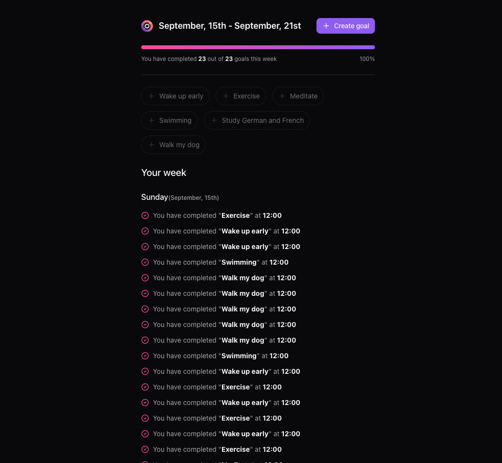
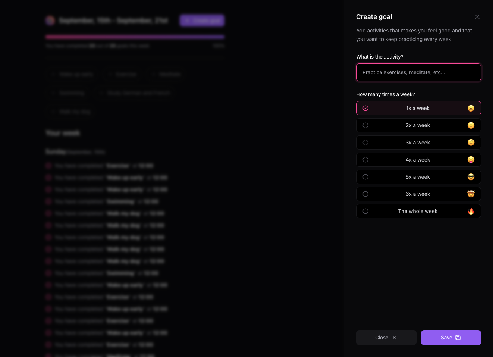

# IN ORBIT - App to manage your weekly goals





## IN ORBIT BACKEND - API
### STACK USED TO BUILD THE PROJECT

<p align-items="center" justify-content="center">
  
</p>

Our backend is built using [Node.js](https://nodejs.org/) with [Fastify](https://fastify.dev/).

The Database we chose to implement in the In Orbit was [Postgres](https://www.postgresql.org/) with [Drizzle](https://orm.drizzle.team/) as our ODM (Object Data Modelling).

The port we are using for the Database to be running is **5432** and we are using [Docker](https://www.docker.com/) to run it.

## TO RUN THE PROJECT

Since we are using [NPM](https://www.npmjs.com/) as our Package Manager we will run the commands using **npm**.

- To run in Development Mode we use the command:

```javascript
npm run dev
```

## IN ORBIT FRONTEND - WEB APPLICATION

<p align-items="center" justify-content="center">
  
</p>

The project was built using [React.js](https://react.dev/) and [Vite](https://vitejs.dev/) with [NPM](https://www.npmjs.com/) as our package manager.

As for the UI, we've used [TailwindCSS](https://tailwindcss.com/), [Tailwind Merge](https://www.npmjs.com/package/tailwind-merge) to style it with the help of [Radix](https://www.radix-ui.com/) to style our dialogs, buttons, inputs, labls and other components.

To handle the forms where we add the new goals we've used [React-Hook-Form](https://react-hook-form.com/) in combination with [Zod](https://zod.dev/). And in this project I've decided to try [Biome](https://biomejs.dev/) to lint our code instead of the tradidional ESLint with Prettier.

These are the steps to execute our project:

- To run in Development mode we use the command:

```javascript
npm run dev
```

The command yarn dev will execute vite.

The command yarn build will execute tsc which means Typescript Compiler that will turn the Typescript code into Javascript to be understood by the browsers.


## API WITH REACT QUERY

To handle our requests to the backend we are using [React Query](https://tanstack.com/query/latest).

# License
© Done with a lot of &#10084; by Hugo Ramon Pereira -> [Portfolio](https://hugoramonpereira.dev/) -> [LinkedIn](https://www.linkedin.com/in/hugo-ramon-pereira/) 🇧🇷 in a training provided by [Rocketseat](https://www.rocketseat.com.br/).
